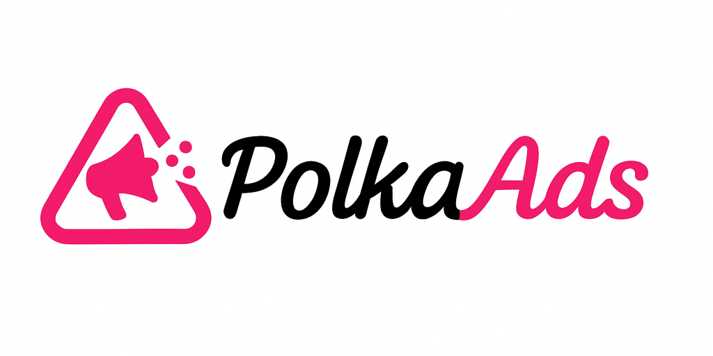

# PolkaAds

A decentralized advertisement platform built on Polkadot that lets users watch ads instead of paying transaction fees, on the Polkadot ecosystem using Substrate pallets and parachain technology.



## Project Overview

PolkaAds enables a gasless transaction experience where users watch relevant ads to have their transaction fees sponsored by advertisers. The platform leverages Polkadot's unique architecture, including custom pallets, XCM for cross-chain messaging, and integration with MetaMask Snap for seamless user experience.

## How It Works

### For Advertisers
1. Submit ad details including wallet address, ad name, description, IPFS-hosted video link, and funding amount
2. Ad is deployed on-chain via custom Substrate pallet
3. Track ad performance and views through on-chain events

### For Users
1. Initiate a transaction on the platform
2. MetaMask Snap displays a randomly selected ad from available active ads
3. Watch the ad to completion
4. Transaction fee is automatically sponsored by the advertiser's fund
5. Transaction executes without user paying fees

### For the Platform
- Randomized ad selection from available active ads
- On-chain ad spot management via custom Substrate pallets
- Event-driven tracking and verification
- Cross-chain compatibility via XCM (Cross-Consensus Messaging)

## Architecture

### Core Components

#### 1. Substrate Pallets (Blockchain Layer)
- **pallet-ads**: Manages ad spots, advertiser registrations, and ad metadata
- **pallet-fee-sponsorship**: Handles transaction fee sponsorship logic (similar to ERC-4337 Paymaster)
- **pallet-ad-tracking**: Tracks ad views and emits verification events

#### 2. MetaMask Snap
- Custom Snap for Polkadot/Substrate integration
- Displays randomly selected ads during transactions
- Connects to backend to fetch ad data from IPFS
- Handles user interaction tracking

#### 3. Web Frontend
- Next.js application for advertiser dashboard and user interface
- Polkadot.js integration for wallet connectivity
- Ad submission and management interface
- Real-time analytics dashboard

#### 4. Storage Layer
- **Crust Network**: Decentralized IPFS-compatible storage for ad videos and media (native Polkadot integration)
- **On-chain storage**: Ad metadata, sponsorship records, view events

## Technology Stack

### Blockchain
- **Polkadot SDK**: Core blockchain framework
- **Substrate**: Custom runtime and pallet development
- **Polkadot.js**: JavaScript API for blockchain interaction
- **XCM**: Cross-chain messaging for multi-parachain support

### Frontend & UX
- **Next.js**: Web application framework
- **MetaMask Snaps**: Custom wallet integration
- **Polkadot.js Extension**: Wallet connectivity
- **TailwindCSS**: UI styling

### Storage & Infrastructure
- **Crust Network**: Decentralized IPFS-compatible storage (Polkadot-native)
- **Substrate Node**: Blockchain node infrastructure

## Project Structure

```
PolkaAds/
├── pallets/                    # Custom Substrate pallets
│   ├── ads/                   # Ad management pallet
│   ├── fee-sponsorship/       # Fee sponsorship logic
│   └── ad-tracking/           # View tracking and events
├── runtime/                    # Substrate runtime configuration
├── node/                       # Blockchain node implementation
├── snap/                       # MetaMask Snap for Polkadot
│   └── packages/
├── web/                        # Next.js frontend
│   ├── app/
│   ├── components/
│   └── lib/
└── scripts/                    # Deployment and utility scripts
```

## Crust Network Integration

PolkaAds leverages **Crust Network** as its primary decentralized storage solution, providing several advantages over traditional IPFS:

### Why Crust Network?
- **Native Polkadot Integration**: Built as a Substrate parachain, seamless integration with PolkaAds
- **Incentivized Storage**: Guaranteed file persistence through economic incentives
- **IPFS Compatible**: Full IPFS protocol support with enhanced reliability
- **Cross-chain Storage**: XCM-enabled storage access across parachains
- **Decentralized Pinning**: No reliance on centralized pinning services

### Storage Workflow
1. **Upload**: Advertisers upload video ads to Crust Network via SDK
2. **Pin**: Files are automatically pinned across distributed storage nodes
3. **Store CID**: IPFS CID is stored in `pallet-ads` on-chain metadata
4. **Retrieve**: MetaMask Snap fetches videos using CID from Crust gateway
5. **Verify**: On-chain verification ensures content integrity

### Integration Points
- **pallet-ads**: Stores Crust CIDs for each ad
- **Web Frontend**: Crust SDK for file uploads
- **MetaMask Snap**: Retrieves ads from Crust gateway

### Crust Network Features Used
- **Storage Order**: Place storage orders for ad videos
- **File Retrieval**: Fast CDN-like retrieval via Crust gateways
- **Storage Monitoring**: Track file status and replica count
- **Cross-chain Messaging**: XCM for parachain storage coordination

### Technical Advantages
- **Lower fees**: Polkadot's efficient consensus and fee structure
- **Native integration**: Pallets provide deeper blockchain integration
- **Cross-chain ready**: XCM enables multi-parachain ad networks
- **Upgradability**: Forkless runtime upgrades for continuous improvement
- **Governance**: On-chain governance for platform parameters

## Development Roadmap

### Phase 1: Foundation (Current)
- [ ] Set up Substrate node with custom runtime
- [ ] Develop core pallets (ads, fee-sponsorship, ad-tracking)
- [ ] Create basic RPC endpoints for ad queries
- [ ] Set up development environment

### Phase 2: User Experience
- [ ] Develop MetaMask Snap for Polkadot
- [ ] Build Next.js frontend
- [ ] Integrate Polkadot.js wallet
- [ ] Create advertiser dashboard

### Phase 3: Testing & Deployment
- [ ] Deploy to Rococo testnet
- [ ] Conduct security audits
- [ ] Optimize performance
- [ ] Launch on Polkadot parachain

### Phase 4: Advanced Features
- [ ] Cross-chain ad network via XCM
- [ ] Advanced analytics and reporting
- [ ] Governance module for platform parameters
- [ ] Mobile app integration

## Getting Started

### Prerequisites
- Rust (latest stable)
- Node.js 18+
- Polkadot.js Extension
- Crust Network account (or IPFS node as fallback)

### Installation

```bash
# Clone the repository
cd PolkaAds

# Build the Substrate node
cargo build --release

# Install frontend dependencies
cd web
npm install

# Install Snap dependencies
cd ../snap
yarn install
```

### Running the Development Environment

**Note**: The node implementation is currently a placeholder. See [RUNNING.md](./RUNNING.md) for detailed setup instructions.

```bash
# Terminal 1: Start Substrate node (see RUNNING.md for setup)
# Option A: Use Substrate node template (recommended)
# Option B: Build runtime only for testing

# Terminal 2: Start frontend
cd web
npm run dev
```

**Quick Start**: See [RUNNING.md](./RUNNING.md) for complete setup instructions.

## Configuration

### Substrate Node
- Network: Development/Rococo/Polkadot
- RPC endpoint: ws://localhost:9944
- Custom pallets enabled

### Crust Network Storage
- Crust Network API integration for file uploads
- IPFS CID storage in on-chain metadata
- Decentralized pinning via Crust's incentive layer
- Cross-chain file retrieval via XCM

## Smart Contract Equivalents (Pallets)

### pallet-ads
Manages ad inventory and advertiser accounts
- `create_ad_spot()`: Create new ad placement slot
- `register_advertiser()`: Register advertiser account
- `submit_ad()`: Submit ad with metadata and funding
- `get_available_spots()`: Query available ad slots

### pallet-fee-sponsorship
Handles transaction fee sponsorship
- `sponsor_transaction()`: Mark transaction for sponsorship
- `verify_ad_view()`: Verify user watched ad
- `reimburse_fee()`: Execute fee reimbursement
- `withdraw_funds()`: Advertiser fund management

### pallet-ad-tracking
Tracks ad performance and views
- `record_view()`: Log ad view event
- `record_click()`: Log ad click event
- `get_ad_metrics()`: Query ad performance data

## Security Considerations

- Pallet-level access controls
- Signed extrinsics for all state changes
- View verification to prevent fraud
- Fund escrow in fee-sponsorship pallet
- Rate limiting on ad views per user

## Contributing

We welcome contributions! Please see CONTRIBUTING.md for guidelines.

## License

This project is licensed under the MIT License - see LICENSE file for details.

## Acknowledgments

- Polkadot SDK and Substrate framework
- MetaMask Snaps team

## Contact & Resources

- Documentation: [Coming Soon]
- Testnet Explorer: [Coming Soon]
- Discord: [Coming Soon]
- Twitter: [Coming Soon]

---

Built with ❤️ for the Polkadot ecosystem
